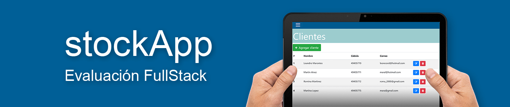
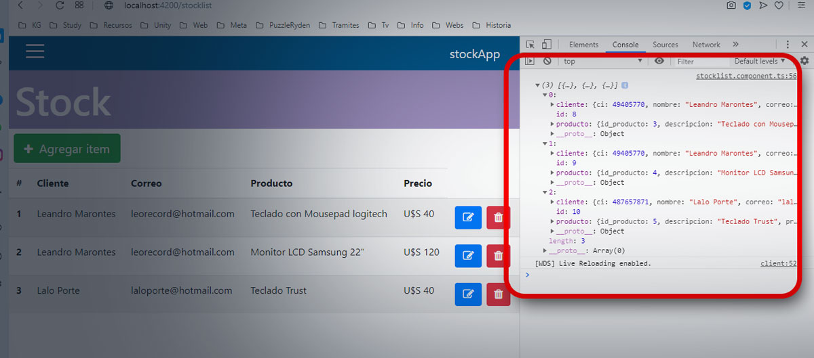

# Descripción de carpetas

* **app_compilado:** app compilada y lista para ejecutar (la misma debe estar en la carpeta de alojamiento de sitios (htdocs, www, etc)).

* **app_desarrollo:** proyecto Angular del desarrollo de la app.

* **Z_documentación:** carpeta que contiene el archivo *stockAppDocument.pdf* con diagrama, diccionario y tablas de la Base de Datos, y el archivo .sql para subir a phpmyadmin (tiene datos ingresados para ejecutar la app).

* **Z_taller_multimedia:** archivos varios para entorno visual y videotutoriales (desde los que se puede acceder en el menú de la app)

# Advertencia

* **Una vez ejecutada la app en un navegador:** para poder ver el objeto requerido con la id y los objetos **Cliente** y **Producto**, abrir la consola del navegador para poder verlo.

